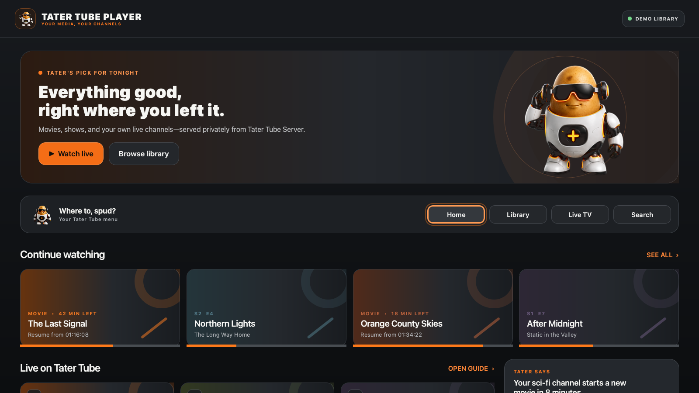

# Tater Tube Player

Tater Tube Player is a modern, artwork-first television and desktop player for
[Tater Tube Server](https://github.com/TaterTotterson/tater-tube-server).

This repository contains the official Tater Tube Player family. The Qt client
at the repository root targets Steam and Steam Deck first; native `apple-tv/`
and `google-tv/` clients will be added here as those platforms begin. Shared
API contracts, design assets, demo content, and release policy stay together.

The Player is intentionally independent
from the GPL-licensed retro player: no source code from that client is copied
here. Existing Tater Tube applications keep their current names and behavior.



## Product direction

- Tater Tube Server only; no Plex, Emby, or Jellyfin integrations
- Steam and Steam Deck first
- Native Apple TV and Google TV clients after the server contract stabilizes
- Grey, graphite, white, and Tater orange visual system
- Poster and backdrop artwork, Continue Watching, search, and details
- Tube TV channels, guide data, user-supplied commercial breaks, and bumpers
- Tater recommendations and narration through Tater Tube Server

## Current milestone

The current milestone is a Steam Deck-ready browsing and playback prototype
with:

- a couch-friendly modern home screen;
- a Home-only navigation strip plus an edge-triggered slide-out menu for TV remotes;
- keyboard, controller, and remote-visible focus states;
- Tater Tube Server URL and six-digit PIN pairing;
- prototype persistence for the server address and player token;
- live Continue Watching, Recently Added, and Tube TV home rows from
  `/api/v1/player/home`;
- full-screen direct playback for local movies and episodes;
- server-backed Library browsing across local collections, discovery filters,
  folders, shows, and seasons, with incremental title rendering;
- a refreshable Live TV lineup with channel now/next information and one-click
  tuning;
- capability-aware playback planning for the active screen and audio output;
- independent video and audio decisions: direct play, audio-only conversion,
  video-only conversion, or full H.264/AAC conversion;
- Tube TV HLS playback that preserves server-scheduled commercials, spots,
  bumpers, and station IDs;
- play/pause, 10-second seeking, volume, back, and auto-hiding playback controls
  for Steam Input, keyboard, and touch;
- resume-position loading and periodic playback progress updates;
- local poster discovery for media-adjacent `poster`, `folder`, `cover`, and
  title-matched JPG, PNG, or WebP files;
- a deterministic demo mode for visual development and screenshots.

The content shown in demo mode is fictional placeholder data. Normal paired
mode uses the versioned Tater Tube Server player API.

The pairing surface is captured in
[`docs/screenshots/pairing.png`](docs/screenshots/pairing.png).

## Build

Requirements:

- CMake 3.24+
- Qt 6.8+ with Quick, Quick Controls, QML, Multimedia, Network, and Test
- A C++20 compiler
- Tater Tube Server with the `/api/v1/player/home` endpoint
- Tater Tube Server 1.4.33+ for the complete first Steam release feature set

```bash
cmake -S . -B build -DCMAKE_BUILD_TYPE=Debug
cmake --build build --parallel
ctest --test-dir build --output-on-failure
./build/tater-tube-player --demo                         # Windows/Linux
./build/tater-tube-player.app/Contents/MacOS/tater-tube-player --demo  # macOS
```

Create an offscreen design snapshot:

```bash
QT_QPA_PLATFORM=offscreen \
  ./build/tater-tube-player.app/Contents/MacOS/tater-tube-player \
  --demo --screenshot=build/home.png
```

### Steam Deck development build

For early hardware testing, the player can run from an isolated Arch Distrobox
without unlocking SteamOS. Create a container named `tater-player-build` with
CMake, Ninja, Qt 6 (including Qt Multimedia), FFmpeg, PulseAudio client
libraries, SDL2, and a C++ compiler, then configure the Deck build at
`~/Tater-Tube-Player/build-deck`.

The development launcher is:

```bash
./scripts/run-steam-deck-dev.sh
```

`packaging/linux/com.taterassistant.TaterTubePlayer.desktop` can be added to
Steam as a non-Steam game for Gaming Mode and Steam Input testing. This
Distrobox launcher is only for development; the Steam release will ship a
self-contained runtime and will not require Distrobox.

The Deck launcher forwards SteamOS's PipeWire/Pulse audio socket into the
development container. The player follows changes to the system's default
audio output, reports the active display, decoder, channel, and output
capabilities to Tater Tube Server, and asks the server for the least destructive
playback path. The server can preserve both tracks, convert only audio, convert
only video while preserving audio, or convert both tracks. If a selective path
fails during playback, the player retries with a full H.264/AAC transcode.

The display report also includes HDR10, HDR10+, HLG, and Dolby Vision support
read from the connected display's EDID on Linux. HDR is only advertised as an
active direct-play path when both the display and the playback transport confirm
it. Otherwise the server tone-maps HDR video to SDR while preserving compatible
audio. This avoids washed-out HDR on SDR outputs and gives native Apple TV and
Google TV clients the same display-aware contract.

The current Qt Multimedia engine decodes supported audio to PCM; it does not
claim encoded HDMI bitstream support. The versioned capability contract already
supports passthrough declarations for native Apple TV and Google TV players, or
for a future Steam playback engine selected under the project's license policy.

The paired-player token is stored in the current operating-system user's Qt
settings file. On Linux, the player forces that file to user-read/write only
(`0600`). The token is sent only to the paired Tater Tube Server and is never
forwarded across HTTP redirects.

## Licensing status

Tater Tube Player is open-source software licensed under the
[Apache License 2.0](LICENSE). The Tater Tube name, logo, and mascot remain
protected brand identifiers; see [TRADEMARKS.md](TRADEMARKS.md).

Release builds dynamically link Qt under LGPLv3. Qt, FFmpeg, SDL, and other
third-party components retain their own licenses. Their notices, source and
relinking requirements are documented in
[THIRD_PARTY_NOTICES.md](THIRD_PARTY_NOTICES.md),
[docs/SOURCE_CODE.md](docs/SOURCE_CODE.md), and
[docs/RELINKING_QT.md](docs/RELINKING_QT.md).
