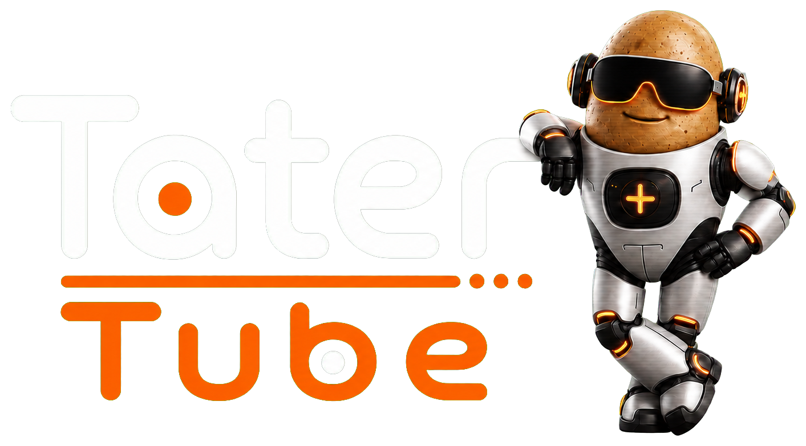

<p align="center">
  
</p>

<p align="center">
  <a href="https://tatertube.tv">
    
  </a>
</p>

<p align="center">
  <a href="https://github.com/TaterTotterson/tater-tube-server">
    
  </a>
  <a href="https://discord.gg/w52namKyXT">
    
  </a>
</p>

# Tater Tube Player

Tater Tube Player is the modern, couch-friendly client for
[Tater Tube Server](https://github.com/TaterTotterson/tater-tube-server). Pair
it with a six-digit code, browse with a controller or remote, and play the
movies, shows, and personal Tube TV channels served from your own collection.

Tater Tube Server is required and is not included. Tater Tube Player does not
include movies, television programs, live channels, or other media.

This repository contains the official Tater Tube Player family. The Qt client
at the repository root targets Steam and Steam Deck first; native `apple-tv/`
and `google-tv/` clients will be added here as those platforms begin. Shared
API contracts, design assets, demo content, and release policy stay together.

The Player is intentionally independent from the GPL-licensed retro player: no
source code, emulator cores, or ROM content from that client is included here.
Existing Tater Tube applications keep their current names and behavior.


## Highlights

- Artwork-rich Home and Library shelves with Continue Watching, Recently
  Added, genres, all movies, and all television series.
- Show, season, and episode views with viewing progress, resume support,
  automatic next-episode playback, and season-to-season continuation.
- A couch-friendly Tube TV guide for server-generated and user-created
  channels, including channel artwork, schedule progress, commercial breaks,
  station IDs, spots, and Tater bumpers.
- Optional Discovery browsing when Newznab streaming is configured on the
  user's server. Partially watched Discovery titles can be resumed from
  Continue Watching.
- Optional Tater Picks recommendations, explanations, and voice briefing when
  the user separately configures Tater Link.
- A compact playback overlay with progress, playback-path details, subtitle
  selection, and alternate audio-track selection. Subtitles start off by
  default.
- Controller-first navigation with held D-pad scrolling, page jumps, Back, and
  a slide-out navigation rail. Touch and keyboard input remain available.
- Resolution-aware rendering for the Steam Deck display and connected 1080p,
  1440p, or 4K televisions.
- Persistent content and artwork caches so shelves appear immediately while
  changed content refreshes in the background.
- A deterministic demo mode with fictional content for review, screenshots,
  and visual development.

Normal paired mode uses authenticated, versioned Tater Tube Server player APIs.
The content shown in demo mode is fictional placeholder data.

The pairing surface is captured in
[`docs/screenshots/pairing.png`](docs/screenshots/pairing.png).

## Playback and transcoding

Before playback, the Player reports the active display resolution, decoder,
audio output, channel count, and detected HDMI capabilities. Tater Tube Server
then chooses the least destructive compatible path:

- direct play when both tracks are compatible;
- copy the video and convert only the audio;
- convert only the video and preserve compatible audio; or
- convert both tracks when required.

The Steam build uses a separately replaceable, LGPL-compatible mpv executable
for playback. It selects the best non-commentary English audio track by default,
allows audio and subtitle tracks to be changed during playback, and requests
encoded HDMI audio passthrough only for formats reported by the connected
display. Unsupported audio is decoded or converted instead.

Tube TV remains scheduled by the server, so transitions between programs,
commercials, spots, bumpers, and station IDs stay synchronized across players.
The Player reports live and on-demand progress back to the server for resume
state, Continue Watching, playback history, and the server dashboard.

## Server compatibility

Tater Tube Player connects only to Tater Tube Server; it does not connect to
Plex, Emby, or Jellyfin. Tater Tube Server 1.4.46 or newer is recommended for
the complete current Player feature set.

The modern `/api/v1/player/*` routes are separate from the compatibility routes
used by the original Tater Tube players.

## Build from source

Requirements:

- CMake 3.24+
- Qt 6.8+ with Quick, Quick Controls, QML, Multimedia, Network, and Test
- A C++20 compiler
- Tater Tube Server for paired operation

```bash
cmake -S . -B build -DCMAKE_BUILD_TYPE=Debug
cmake --build build --parallel
ctest --test-dir build --output-on-failure
./build/tater-tube-player --demo                         # Linux
./build/tater-tube-player.app/Contents/MacOS/tater-tube-player --demo  # macOS
```

Create an offscreen design snapshot:

```bash
QT_QPA_PLATFORM=offscreen \
  ./build/tater-tube-player.app/Contents/MacOS/tater-tube-player \
  --demo --screenshot=build/home.png
```

### Steam Deck development

The release on Steam is packaged as a self-contained Linux build and does not
require a development container. For source development on a Steam Deck, the
project can also be built in an isolated Arch Distrobox containing CMake,
Ninja, Qt 6, FFmpeg, PulseAudio client libraries, SDL2, and a C++ compiler.

The development launcher is:

```bash
./scripts/run-steam-deck-dev.sh
```

`packaging/linux/com.taterassistant.TaterTubePlayer.desktop` can be added to
Steam as a non-Steam application while testing a local development build in
Gaming Mode.

## Security and privacy

The paired-player token is stored in the current operating-system user's Qt
settings file. On Linux, the Player restricts that file to the user (`0600`).
The token is sent only to the paired Tater Tube Server and is never
forwarded across HTTP redirects.

Tater Picks is optional and hidden unless Tater Link is configured. The Player
communicates with the user's Tater Tube Server rather than directly with an AI
provider. See [PRIVACY.md](PRIVACY.md) for the complete data-flow description.

## Platform direction

The current client targets Steam and Steam Deck. Future native Apple TV and
Google TV clients can share the same server contracts, design assets, and
product behavior from this repository while using each platform's native media
framework.

## License

Tater Tube Player is open-source software licensed under the
[Apache License 2.0](LICENSE). The Tater Tube name, logo, and mascot remain
protected brand identifiers; see [TRADEMARKS.md](TRADEMARKS.md).

Release builds dynamically link Qt under LGPLv3. Qt, FFmpeg, SDL, mpv, and
other third-party components retain their respective licenses. Notices, source
availability, and Qt relinking instructions are provided in
[THIRD_PARTY_NOTICES.md](THIRD_PARTY_NOTICES.md),
[docs/SOURCE_CODE.md](docs/SOURCE_CODE.md), and
[docs/RELINKING_QT.md](docs/RELINKING_QT.md).
